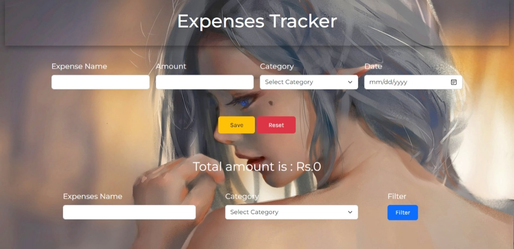
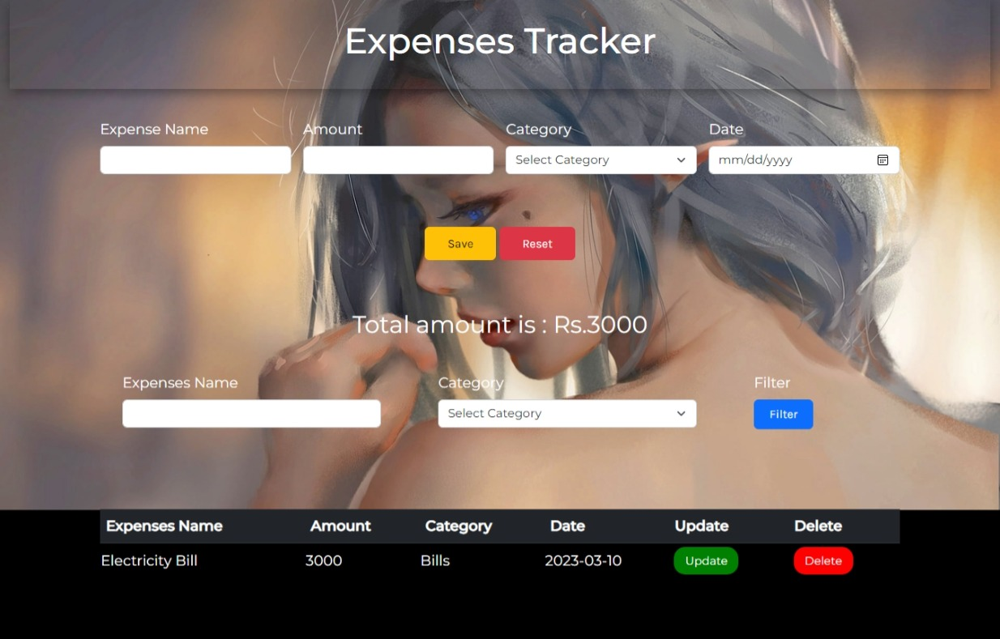
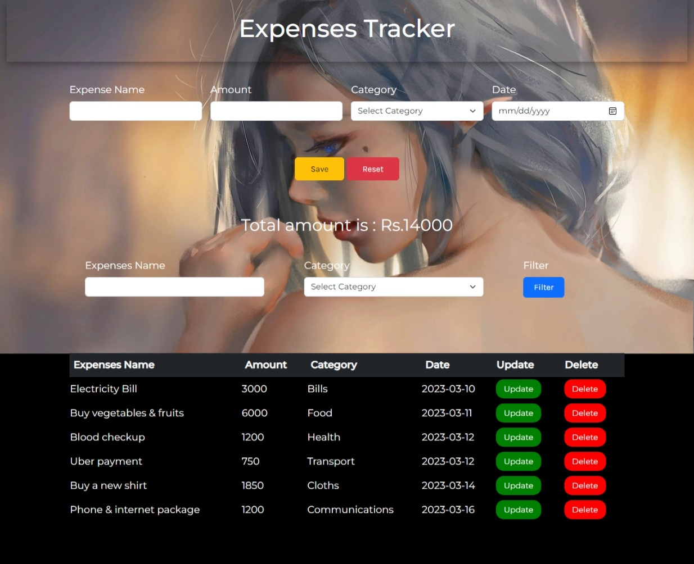

# Expenses Tracker Application - Javascript

In this simple expenses tracker application project I have used  some of the more intermediate advanced parts of the document object model or the javascript dom to show  how to build this web application. Users can add their expenses records and all those records are displaying in a separate table. From that table user can update or delete the each records.

## Features

 - User can add expenses records by enter expenses name, amount, category and date. Also user should fill all the fields of the form to save the record.

 - After save a record successfully , it will display in a table.
 - In that record table , user can see the details of expenses with two buttons which are update & delete buttons.
 - By the update button user can update any record in the table. When the user click it, each details of record goes to text fields of the form and user can do any changes to them. After click the save button again that records will be update.
 - By  the delete button user can delete any record from the list of table.
 - User can search any expenses record from the table by using expenses name and category.
- Total amount of all expenses will be display after each insertions , updations or deletions

## Screenshots

